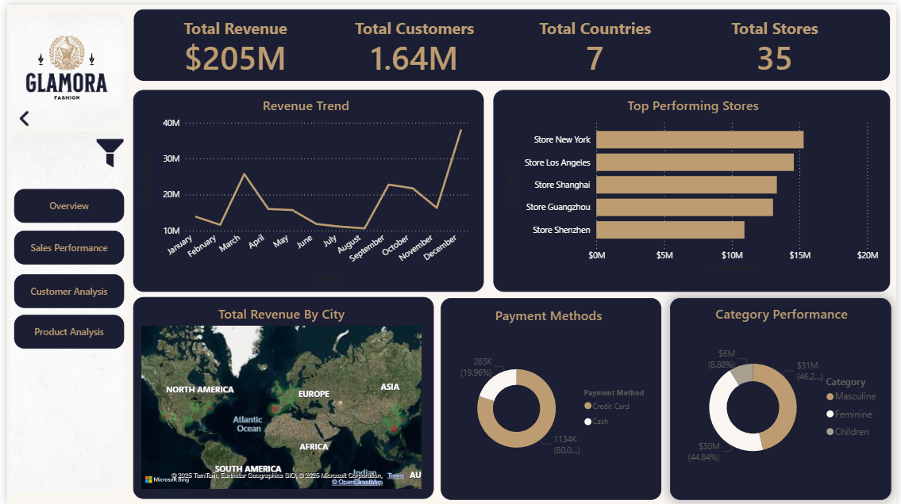
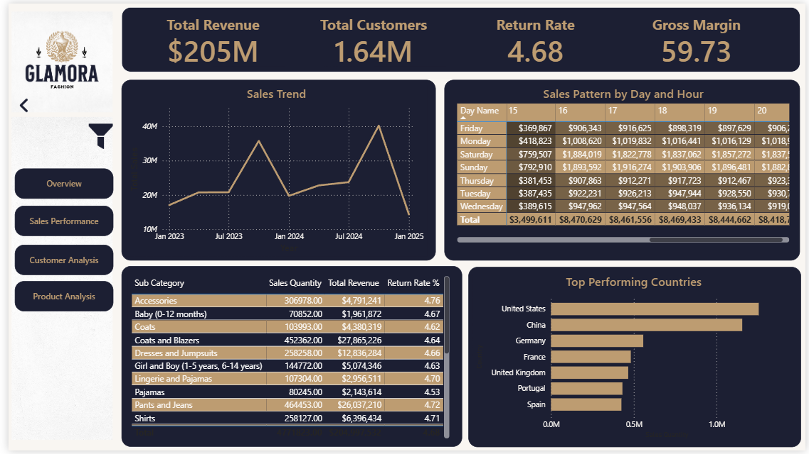
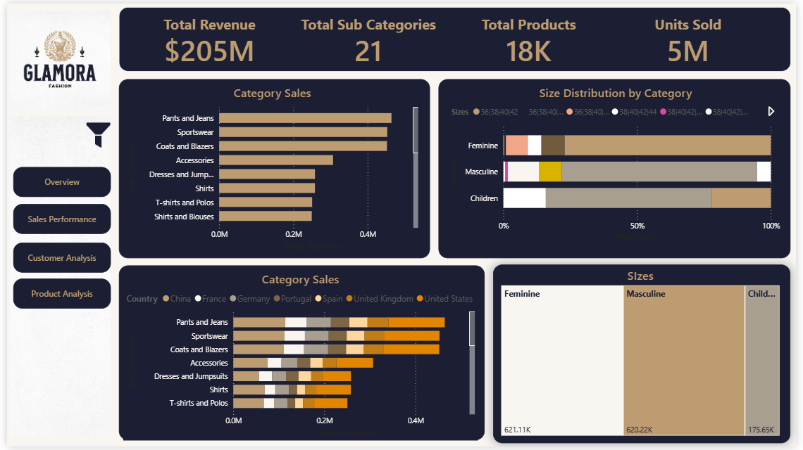
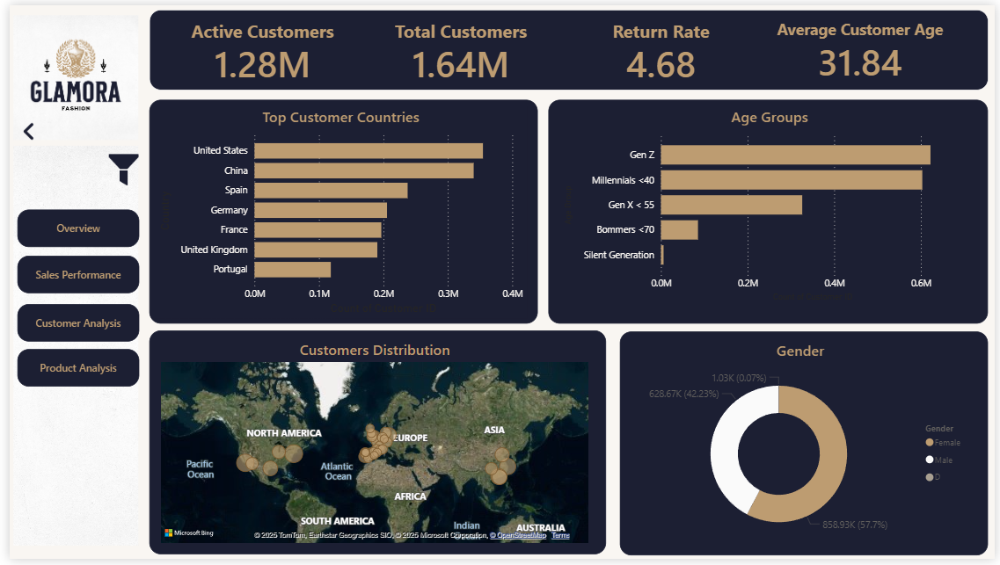

# Retail-Analytics-PowerBI-Dashboard
=======
# 👗 GLAMORA Fashion Dashboard

An interactive Power BI dashboard with a custom visual identity designed from scratch.  
This project delivers actionable insights into customer demographics, sales performance, and product trends, enabling smarter, data-driven decision-making.

---

## 📸 Dashboard Preview

---

## 📊 Project Objectives
- Design and deliver a visually rich, interactive Power BI dashboard.
- Create a complete visual identity (moodboard, color palette, and dashboard theme) from scratch for a consistent and modern look.
- Provide clear insights into customer behavior, sales trends, and product performance.
- Support smarter business strategies with data-driven recommendations.

---

## 🛠 Skills & Tools Used
- **Power BI** – Dashboard design, data visualization, DAX calculations.  
- **Power Query** – Data cleaning, transformations, and preprocessing.  
- **Data Modeling** – Relationships, calculated tables, and measures. 
- **Data Analysis** – Business insights, trend analysis, customer segmentation.  
- **Design & Branding** – Visual identity creation, moodboard, custom color palette.  

---

## 🎨 Visual Identity
- Built a moodboard to set the overall style and direction.  
- Defined a color palette that balances clarity with brand aesthetics.  
- Applied the visual identity consistently across all dashboards for a professional and cohesive design.  

---

## 🗂 Data Overview
- Customers → 1.64M records  9 fields (ID, Name, Email, City, Country, Gender, DOB, Job Title…)
- Discounts → 181 records  6 fields (Start, End, Discount %, Description, Category, Sub-category)
- Employees → 404 records  4 fields (Employee ID, Store ID, Name, Position)
- Products → 17.9K records  12 fields (Category, Sub-category, Multi-language Descriptions, Color, Size, Production Cost)
- Stores → 35 records  8 fields (Store Name, Country, City, Number of Employees, Coordinates…)
- Transactions → 6.4M records  19 fields (Invoice, Customer, Product, Date, Size, Color, Price, Quantity, Store, Employee, Payment Method…)

---

## 🛠 Data Preparation & Modeling
- **Data Cleaning & Transformation** in Power Query:  
  - Converted **Date of Birth → Age** and created **Age Groups**.  
  - Removed **798 duplicate transactions**.  
- **Date Table**: Created a custom calendar with Year, Month, Quarter, Week, Day, and IsWeekend columns.  
- **Exchange Rates Table**: Built with USD base + currency symbols for normalized revenue reporting.  
- **Data Modeling**:  
  - Established star-schema relationships between **Customers, Products, Stores, Employees, Transactions, Discounts**.  
  - Created **calculated measures & DAX formulas** to support KPIs like revenue, sales by category, seasonal performance, and customer segmentation.  
  - Optimized model for **performance and scalability** with 6.4M+ transaction rows.

 ### 📐 Data Model Diagram

---

## 📊 Dashboards
- Overview Dashboard – General KPIs and trends.
- Sales Performance Dashboard – Seasonality, revenue, growth.
- Customer Analysis Dashboard – Demographics, locations, preferences.
- Product Analysis Dashboard – Categories, size preferences, revenue split.

---

## 🔑 Key Findings
- Seasonality Q4 is strongest ($130.6M avg), Q1 weakest ($56.7M).
- Weekly Sales Weekends drive 2x higher sales than weekdays.
- Growth Strong upward trend from 2023 to 2024.
- Geography US leads with 354K customers (21.6%).
- Category Split Feminine (46.5%), Masculine (44.6%), Children (8.9%).
- Size Preference M-size dominates ($309.8M revenue).

---

## 🚀 Recommendations
- Seasonal Strategy  
  - Maximize Q4 with holiday campaigns.  
  - Boost Q1 sales with New Year promotions.  
- Weekend Focus  
  - Increase weekend-specific marketing spend.  
  - Launch promotions tailored for weekends.  
- Market Penetration  
  - Strengthen presence in US and China.  
- Category Investment
  - Focus on BlazersFormal Wear, Jeans & Pants, Sports Wear.  

---

## 🙌 Acknowledgment
This project was completed as the **final internship project at Exology**.  
It demonstrates advanced **data analysis, visualization, and dashboard design** in **Power BI**.  
The **visual identity and design system were built entirely from scratch** to ensure a unique and professional presentation.
